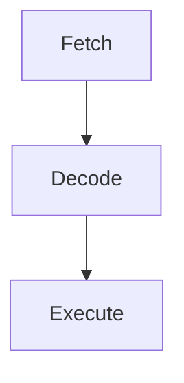

# CHIP-8 Emulator

## Components:

- Memory: 4KB RAM
- Display: 64x32 px
- PC => 2 bytes, 12 bits used
- Mem Pointer Register (I)  => 2 bytes, 12 bits used
- Stack for 2 byte addresses
- 1 byte delay timer at 60 Hz
- 1 byte sound timer at 60 Hz
- 16-key keyboard input
- 16 1 byte registers labeled 0x0-F
    - V0 -> VF
    - VF is also a *flag register* for overflow operations

## CPU Pipeline

## Screen

Each pixel on the screen will either be on or off, so can be represented by a bool. Create an array of width * hight slots of bools.

## PC

- CHIP-8 instructions starts at 0x200

## Fonts

- Store A-F and 0-9
- Each character is made up of 5 rows of 8 pixels
    - Each row is a byte