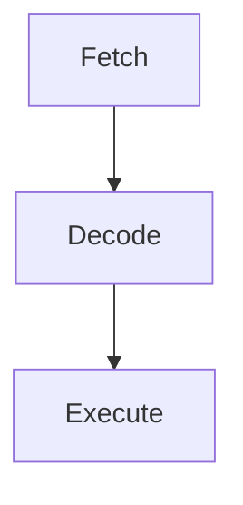

# CHIP-8 Emulator

To play:

```
cargo run <path/to/game>
```
## Controls
|Keyboard|Chip-8|
|--------|------|
|1|1|
|2|2|
|3|3|
|4|C|
|Q|4|
|W|5|
|E|6|
|R|D|
|A|7|
|S|8|
|D|9|
|F|E|
|Z|A|
|X|0|
|C|B|
|V|F|
|Tab|Reset|
|Escape|Quit|


## Components:

- Memory: 4KB RAM
- Display: 64x32 px
- PC => 2 bytes, 12 bits used
- Mem Pointer Register (I)  => 2 bytes, 12 bits used
- Stack for 2 byte addresses
- 1 byte delay timer at 60 Hz
- 1 byte sound timer at 60 Hz
- 16-key keyboard input
- 16 1 byte registers labeled 0x0-F
    - V0 -> VF
    - VF is also a *flag register* for overflow operations

## CPU Pipeline (single-cycle)



- Instructions are 2 bytes stored in big-endian

## Screen

Each pixel on the screen will either be on or off, so can be represented by a bool. Create an array of width * hight slots of bools.

## PC

- CHIP-8 instructions starts at 0x200

## Fonts

- Store A-F and 0-9
- Each character is made up of 5 rows of 8 pixels
    - Each row is a byte